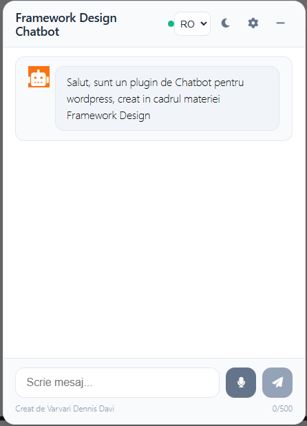
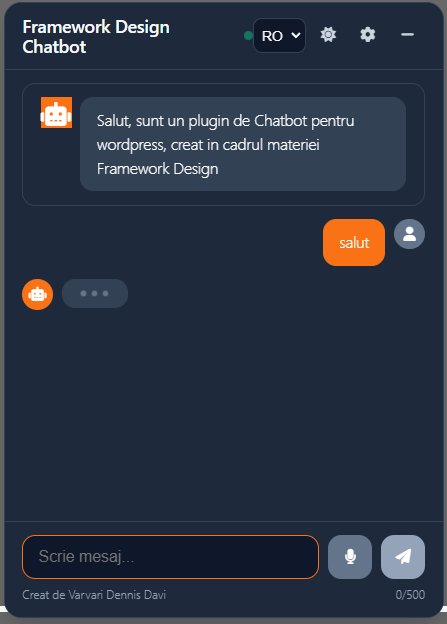
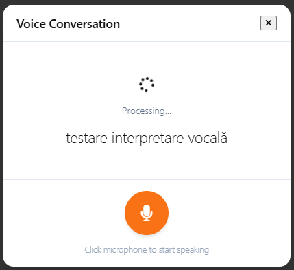
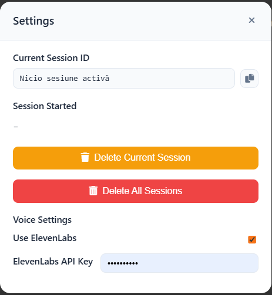
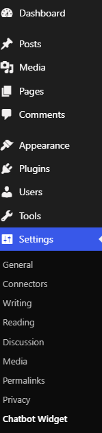
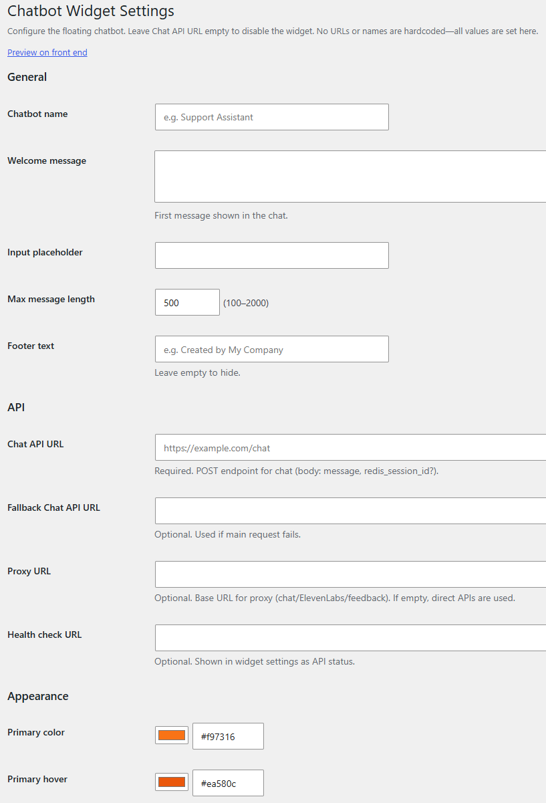
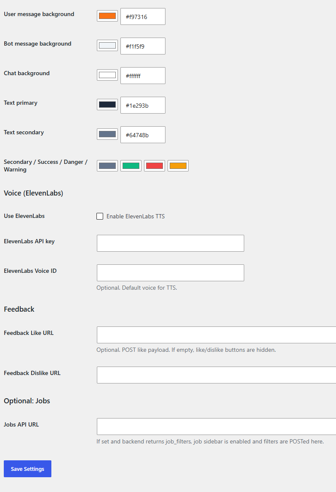

# WP Chatbot Widget

> **Framework Design** | Masters coursework  
> Category: **Extension / Plugin for an existing framework** (WordPress)

A floating chatbot WordPress plugin. No URLs or names are hardcoded; everything is configured through the admin settings page.

## Live Demo

The plugin is running live at **[fd.projekttech.ro](https://fd.projekttech.ro/)**. Visit the site to interact with the deployed widget.

---

## Table of Contents

- [What It Is](#what-it-is)
- [Screenshots](#screenshots)
- [How It Works](#how-it-works)
- [Architecture](#architecture)
- [Installation](#installation)
- [Configuration](#configuration)
- [API Contract](#api-contract)
- [File Structure](#file-structure)
- [Extending the Plugin](#extending-the-plugin)
- [Academic Context](#academic-context)

---

## What It Is

**WP Chatbot Widget** is a WordPress plugin, type-(b) *extension for an existing framework*. WordPress is the framework; this plugin hooks into it through its official extension points (action hooks, Settings API, asset pipeline) to add a floating chatbot to any WordPress site's front end.

### Feature summary

| Feature | Description |
|---|---|
| Floating window + bubble | Chat window opens on load; minimizes to a bubble; state persists across page navigation |
| Config-driven | All URLs, colors, and labels come from the WordPress admin; nothing is hardcoded |
| Multilingual UI | EN / RO / FR / DE / HU, with per-language translations for all UI strings |
| Light / Dark mode | Toggle in the widget header; preference saved in `localStorage` |
| Voice input | Uses the browser Web Speech API (SpeechRecognition) |
| Voice output | ElevenLabs TTS (configurable) with fallback to browser SpeechSynthesis |
| Feedback (like / dislike) | Per-message thumbs up/down; dislike opens a reason form; both POST to configurable endpoints |
| Session management | Redis session ID persisted in `localStorage`; copyable from the in-widget settings panel |
| Health check | Widget settings panel shows live API status (configurable GET endpoint) |
| Job sidebar | Optional: if the backend returns `job_filters`, the plugin fetches and displays job listings |
| Fallback URL chain | Primary URL, then Fallback URL, tried automatically on failure |
| Input sanitization | All admin settings sanitized server-side via the WordPress Settings API before storage |

---

## Screenshots

### Chat window, light mode

The floating chat window on the front end. Configured with the name *"Framework Design Chatbot"*, a welcome message in Romanian, a footer credit, and the language selector set to RO.



---

### Chat window, dark mode

Dark mode is toggled by clicking the moon/sun icon in the header. The preference is saved in `localStorage` and applied on subsequent page loads. All colors switch via CSS custom properties; no separate stylesheet is loaded.



---

### Minimized bubble

Clicking the `-` button minimizes the window to a floating orange bubble. Clicking the bubble restores the full window. The state is persisted in `sessionStorage` across page navigation within the same tab.


---

### Voice conversation popup

Clicking the microphone button opens the voice popup. It cycles through three states: *Listening* (speech recognition active, live transcript shown), *Processing* (API request in flight), and *Speaking* (bot answer read back via ElevenLabs TTS or browser SpeechSynthesis). The language for recognition and synthesis follows the UI language selector.



---

### In-widget settings modal

Clicking the gear icon in the chat header opens the settings panel. It shows the current session ID (copyable to clipboard), session start time, session deletion buttons, ElevenLabs API key input, voice selector, and a live API health-check status.



---

### WordPress admin: Settings menu location

The plugin registers itself under **Settings > Chatbot Widget** using WordPress's `add_options_page()` API, the standard integration point for site-wide plugin configuration. No theme files are modified.



---

### Admin settings page: General, API & Appearance

Chatbot name, welcome message, placeholder text, character limit, footer text, all API URLs (primary, fallback, proxy, health check), and the primary color pickers. Every field is sanitized before being written to the WordPress options database.



---

### Admin settings page: Colors, Voice, Feedback & Jobs

Full color palette (light + dark mode variants), ElevenLabs TTS toggle and credentials, feedback endpoint URLs, and the optional Jobs API URL.



---

## How It Works

### The WordPress extension model

WordPress uses a hook system: plugins register callbacks against named events fired by the framework at defined points in the request lifecycle. This plugin uses four action hooks:

```php
// Registers the settings page in the WP admin sidebar
add_action( 'admin_menu', 'wp_chatbot_widget_add_settings_page' );

// Registers the settings group + sanitize callback via the WP Settings API
add_action( 'admin_init', array( 'WP_Chatbot_Widget_Settings', 'register' ) );

// Enqueues CSS + JS on the front end; passes PHP config to JS
add_action( 'wp_enqueue_scripts', 'wp_chatbot_widget_enqueue_frontend' );

// Outputs the root <div> just before </body>
add_action( 'wp_footer', 'wp_chatbot_widget_render_container', 5 );
```

No theme files are modified. Activate the plugin, configure it, and it works.

### PHP to JavaScript config bridge

WordPress's `wp_localize_script()` injects the saved settings as a JavaScript global before the plugin scripts execute:

```html
<script>
var wpChatbotWidgetConfig = {
  "chatApiUrl":        "https://your-backend.com/chat",
  "chatbotName":       "Framework Design Chatbot",
  "primaryColor":      "#f97316",
  "elevenlabsEnabled": false,
  ...
};
</script>
```

The frontend scripts read this object at runtime; there are no hardcoded values in the JavaScript.

### CSS variable theming

Every color setting in the admin is serialised into CSS custom properties (`--wp-cb-primary-color`, `--wp-cb-bg-chat`, etc.) and applied as inline styles on the widget's root element. This scopes all styles to the widget. Changing colors only requires updating the admin settings page.

### API call chain with fallback

The plugin builds an ordered list of chat URLs:

```
1. proxyUrl + "/chat"    (if proxy is configured)
2. chatApiUrl            (primary endpoint)
3. fallbackChatApiUrl    (optional fallback)
```

Each is tried in sequence with a 180-second `AbortController` timeout. The first successful response is used.

---

## Architecture

```
WordPress request lifecycle
|
+-- admin_init  ->  WP_Chatbot_Widget_Settings::register()
|                   Registers option key, sanitize callback, settings group
|
+-- admin_menu  ->  add_options_page()
|                   Renders admin/settings-page.php (PHP form -> WP Options DB)
|
+-- Front-end request
    |
    +-- wp_enqueue_scripts
    |   +-- chatbot-widget.css          (all styles, CSS custom properties)
    |   +-- chatbot-core.js             (chat logic, IIFE, no globals)
    |   +-- chatbot-widget.js           (UI shell, depends on core)
    |       +-- wp_localize_script  ->  window.wpChatbotWidgetConfig
    |
    +-- wp_footer
        +-- <div id="wp-chatbot-widget-root" data-css-vars="...">

JavaScript (DOMContentLoaded)
|
+-- chatbot-widget.js
|   +-- Reads window.wpChatbotWidgetConfig
|   +-- Applies CSS custom properties from data-css-vars attribute
|   +-- Builds full widget HTML (bubble + window + modals + voice popup + job sidebar)
|   +-- Handles minimize / bubble toggle (persisted in sessionStorage)
|   +-- Calls WPChatbotCore.init(root, config)
|
+-- chatbot-core.js  ->  window.WPChatbotCore
    +-- Session management      (localStorage)
    +-- API call chain          (fetch + AbortController + fallback)
    +-- Message rendering       (Markdown subset -> HTML, XSS-safe)
    +-- Feedback                (like POST / dislike POST with reason form)
    +-- Voice subsystem         (SpeechRecognition -> API -> ElevenLabs / WebSpeech TTS)
    +-- Job sidebar             (optional, triggered by job_filters in API response)
    +-- i18n                    (EN / RO / FR / DE / HU)
```

---

## Installation

### Requirements

- WordPress 5.0+
- PHP 7.4+
- A backend service implementing the [API contract](#api-contract)

### Steps

1. Clone this repository and zip the `wp-chatbot-widget/` folder, or download it as a zip from GitHub (**Code > Download ZIP**, then extract and re-zip just the `wp-chatbot-widget/` subfolder).
2. In the WordPress admin go to **Plugins > Add New > Upload Plugin**.
3. Upload the zip and click **Install Now**, then **Activate**.
4. Go to **Settings > Chatbot Widget**.
5. Enter at minimum:
   - **Chat API URL**: your backend's POST endpoint
   - **Chatbot name**: displayed in the widget header
6. Click **Save Settings** and visit the front end.

Leaving **Chat API URL** empty disables the widget without deactivating the plugin.

---

## Configuration

All settings are in **Settings > Chatbot Widget**.

### General

| Setting | Description |
|---|---|
| Chatbot name | Name shown in the chat header |
| Welcome message | First bot message shown when the widget opens |
| Input placeholder | Placeholder text in the message field |
| Max message length | Character limit per message (100-2000) |
| Footer text | Small credit text below the input bar |

### API

| Setting | Description |
|---|---|
| Chat API URL | **Required.** POST endpoint for chat messages |
| Fallback Chat API URL | Tried automatically if the primary URL fails |
| Proxy URL | Base URL for a server-side proxy (covers chat, ElevenLabs, feedback) |
| Health check URL | GET endpoint; result shown as API status inside the widget |

### Appearance

Color settings for both light and dark modes: primary color, hover, message backgrounds, text colors, borders, etc. Applied as CSS custom properties; changes take effect on next page load.

### Voice (ElevenLabs)

| Setting | Description |
|---|---|
| Use ElevenLabs | Enables ElevenLabs TTS; falls back to browser SpeechSynthesis if off |
| ElevenLabs API key | Stored in WP options; set a Proxy URL to avoid browser-side exposure |
| ElevenLabs Voice ID | Default TTS voice; users can override it in the in-widget settings panel |

### Feedback

| Setting | Description |
|---|---|
| Feedback Like URL | POST endpoint for thumbs-up events. If empty, feedback buttons are hidden |
| Feedback Dislike URL | POST endpoint for thumbs-down + reason text events |

### Jobs (optional)

| Setting | Description |
|---|---|
| Jobs API URL | If set, and chat responses include `job_filters`, the job sidebar is activated |

---

## API Contract

The plugin works with any backend that implements the following contract.

### Chat

**Request**
```
POST {Chat API URL}
Content-Type: application/json

{
  "message": "Answer in romanian: Salut!",
  "redis_session_id": "optional-existing-session-id"
}
```

The `message` field is prefixed with `"Answer in {language}: "` based on the selected UI language.

**Response**
```json
{
  "answer": "Buna ziua! Cu ce va pot ajuta?",
  "redis_session_id": "abc123",
  "job_filters": { "occupation": "developer" }
}
```

| Field | Required | Description |
|---|---|---|
| `answer` | Yes | Bot reply. Supports `**bold**`, `[link](url)`, `* list item`, and newlines |
| `redis_session_id` | Recommended | Session token; stored in `localStorage` and sent on future requests |
| `job_filters` | No | If present and Jobs API URL is configured, triggers the job sidebar |

### Feedback

```
POST {Feedback Like URL}
{ "type": "like", "message": "...", "sessionId": "...", "timestamp": "...", "likedMessagesCount": 3 }

POST {Feedback Dislike URL}
{ "type": "dislike", "message": "...", "reason": "...", "sessionId": "...", "timestamp": "..." }
```

### Health check

```
GET {Health check URL}
```

Any 2xx response is shown as **OK** (green). Any error is shown as the HTTP status code (red).

---

## File Structure

```
fd-chatbot-plugin/
|
+-- README.md                   This file.
+-- DOCUMENTATION.md            Full technical documentation.
+-- screenshots/                All demo screenshots.
|
+-- wp-chatbot-widget/          The installable plugin directory.
    |
    +-- wp-chatbot-widget.php   Plugin entry point. Constants, requires, hook registrations.
    +-- readme.txt              WordPress.org standard readme.
    |
    +-- includes/
    |   +-- class-settings.php  WP_Chatbot_Widget_Settings
    |                           get_defaults() / get_settings() / register()
    |                           sanitize() / get_frontend_config() / get_css_variables()
    |
    +-- admin/
    |   +-- settings-page.php   Admin settings form (WP Settings API helpers throughout).
    |
    +-- assets/
        +-- css/
        |   +-- chatbot-widget.css  All styles. CSS custom properties prefixed --wp-cb-*.
        |
        +-- js/
            +-- chatbot-core.js     IIFE. Exports window.WPChatbotCore.
            |                       API calls, session, messages, voice, feedback, jobs, i18n.
            |
            +-- chatbot-widget.js   IIFE. Depends on chatbot-core.js.
                                    Widget HTML, minimize/bubble, CSS vars, initialises core.
```

---

## Extending the Plugin

### Add a new UI language

1. Add an entry to the `translations` map in `chatbot-core.js` (all string keys required).
2. Add an `<option>` to the language `<select>` in `chatbot-widget.js` inside `buildMarkup()`.
3. Add the language name to the `langNames` maps in `sendMessage()` and `sendVoiceMessage()`.

### Add a new admin setting

1. Add the key + default to `get_defaults()` in `class-settings.php`.
2. Add sanitization logic to `sanitize()`.
3. Expose it in `get_frontend_config()` if the frontend needs it.
4. Add the `<input>` row in `admin/settings-page.php`.
5. Read it in JavaScript via `config.yourNewKey`.

### Swap the backend

Update **Chat API URL** in the admin settings. Any service that returns `{ "answer": "..." }` is compatible.

---

## Academic Context

This plugin was built as coursework for the **Framework Design** course (Masters, Computer Science).

**Category:** (b) *Extension / plugin for an existing framework*

**Framework:** WordPress (hook-based PHP application framework)  
**Extension mechanism:** Action hooks (`admin_menu`, `admin_init`, `wp_enqueue_scripts`, `wp_footer`) + WordPress Settings API + `wp_localize_script` PHP-to-JS bridge

**Live demo:** [fd.projekttech.ro](https://fd.projekttech.ro/)

**Grading:**
- **S (70%):** Software: a working plugin that correctly extends WordPress using its official APIs
- **D (30%):** Documentation: full technical documentation in `DOCUMENTATION.md`

> Professor's course page: [https://www.cs.ubbcluj.ro/~ilazar/fd/](https://www.cs.ubbcluj.ro/~ilazar/fd/)

---

## License

GPL v2 or later (consistent with WordPress core licensing).
